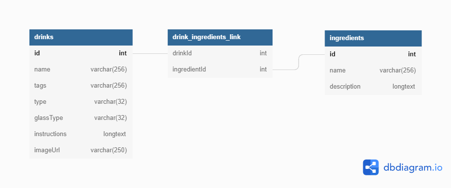

# Example CocktailDB pipeline
Example pipeline to pull in data from thecocktaildb.com. **Note: Not all data is pulled from
TheCocktailDB. Only certain drinks with starting letters were pulled to reduce the time it takes
to run the Airflow DAG (for example purposes)**

- [Running](#running)
- [Fun queries](#fun-queries)
- [Workflow](#cocktaildb-api-workflow)
  - [Search drinks](#search-for-drinks)
  - [Search for alterations](#search-drink-alterations)
  - [Search ingredients](#search-ingredients)
- [Processing data](#processing-data)
- [Architecture](#architecture)
- [Future work](#future-work)

## Running
Ensure docker is installed on your machine. If it's not, [install it](https://docs.docker.com/get-docker/). Once docker
is installed, we can begin. For the very first time, you will need to run `sh init.sh`. This creates the docker network
that is used to communicate between the different services. After your first run, you won't have to run it again unless
you delete the network. You can start up the containers by running: `sh start.sh`. The first time you start up the containers,
it will download the images and install packages, so it will take some time to run. Once everything is up and running,
you can go to the [Airflow homepage](http://localhost:8080). Log in with the username/password combo: `airflow`:`airflow`.

Once you've logged in, you can see the `cocktaildb` DAG (it should be the only one). If you click the toggle next to the
dag name, it will have a blue background, meaning it's "active". If you look to the right, under the Actions heading
and hit the "Play" button, the DAG run will start, and you should have a populated database in a couple of minutes.

Read below for information about how the process works.

## Fun queries
We can connect into the MySQL container and run some queries to figure out some basic information about the drinks we
pulled. To connect, open a command prompt/shell/etc... and type: `docker exec -it mysql bash`. Now that we're inside
the container, we can run `mysql -u root -p`. When the prompt comes up, enter the password: `password!`. Connect to the 
database: `use cocktail_db;`

**NOTE**: You can also connect to the database any other way you're familiar with. You don't necessarily have to go 
through the container.

1) What are the names of the drinks with descriptions longer than 100 characters?
    ```
   SELECT name, LENGTH(instructions) as length 
   FROM drinks 
   WHERE length > 100 
   ORDER BY length DESC;
    ```
2) Which drink types have descriptions longer than 150 characters?
    ```
    SELECT type, AVG(LENGTH(instructions)) as length
    FROM drinks
    GROUP BY type
    HAVING length > 150 ORDER BY length DESC;
    ```
3) What are the names of the top 5 ingredients?
    ```
   SELECT name, COUNT(name) as count
    FROM drink_ingredients_link
     JOIN ingredients i on i.id = drink_ingredients_link.ingredientId
    GROUP BY name
    ORDER BY count DESC
    LIMIT 5;
    ```
4) What cocktail drinks served in a "Collins glass" use vodka or gin?
   ```
   SELECT DISTINCT(d.name) FROM drinks d
    JOIN drink_ingredients_link di on d.id = di.drinkId
    JOIN ingredients i on i.id = di.ingredientId
   WHERE d.glassType = 'Collins glass' AND (i.name = 'vodka' or i.name = 'gin');
   ```


## CocktailDB API workflow
In order to pull all the data from TheCocktailDB, there are a few endpoints to hit to get all the data. The following
section describes these endpoints in order of when to check them. At any point, if you would like to see the full API
documentation provided by TheCocktailDB, check it out [here](https://www.thecocktaildb.com/api.php).

### 1. Search for drinks
This endpoint is reached at https://thecocktaildb.com/api/json/v1/1/search.php?f=$CHARACTER. By going through the alphabet
and numerics, we can find all major drinks that are listed in the database. From what I saw, this does not list alterations
of the drinks (i.e., only "Mojito" is returned, not "Mango Mojito"). Because alterations are not listed, we need to 
return those as well somehow. Luckily, there's another endpoint we can hit for that

### 2. Search drink alterations
After finding the name of the drink, we can search for alterations of it at: www.thecocktaildb.com/api/json/v1/1/search.php?s=$DRINK_NAME.
The resulting list of drinks is stored in the database (after they have been processed of course).

### 3. Search ingredients
Each drink has a list of up to 15 ingredients it can have. These ingredients are not normalized strings (any type of 
accents can be used on the characters, and they can be upper or lower cased in any way). The ingredients
need to be cleaned up and then searched for in TheCocktailDB so that the information about these ingredients
can be stored in the database. The endpoint we will use to search for ingredients will be
www.thecocktaildb.com/api/json/v1/1/search.php?i=$INGREDIENT_NAME

## Processing data
After reading the previous section, it's apparent that there will need to be some data cleaning done in order to
facilitate relational modelling on the data. In general, the data should only have relevant fields and should be
normalized. Every time the data is pulled, it should be validated and then compared to current data to ensure that there
are no duplicates being stored in the database.

## Architecture
For this example, the pipeline focuses on Airflow to call the proper endpoints at TheCocktailDB, and calls custom 
"microservices" hosted by Flask in another Docker container. In actual production scenario, a data lake could be used to
trigger different services to work, rather than have the onus on Airflow to call these endpoints to do the work.

Data is written to CSV files to be loaded into the MySQL database after they've been transformed. Rather than rereading
the CSV file again, the API tells the MySQL database to do a `LOAD DATA INFILE` command.

## Database schema



## Future work
1. More visibility on pipeline run (time, how many records stored, etc...)
3. More error checking
4. Pulling all drinks rather than a subset
   1. Possibly using a dynamically generated dag based on parameters passed in (pass in the letters/numbers to search for)
5. Only drinks that haven't been seen yet are pulled. Update to check the modified date field in the returned object 
6. Use environment variables in Airflow for the API `host:port`
    
